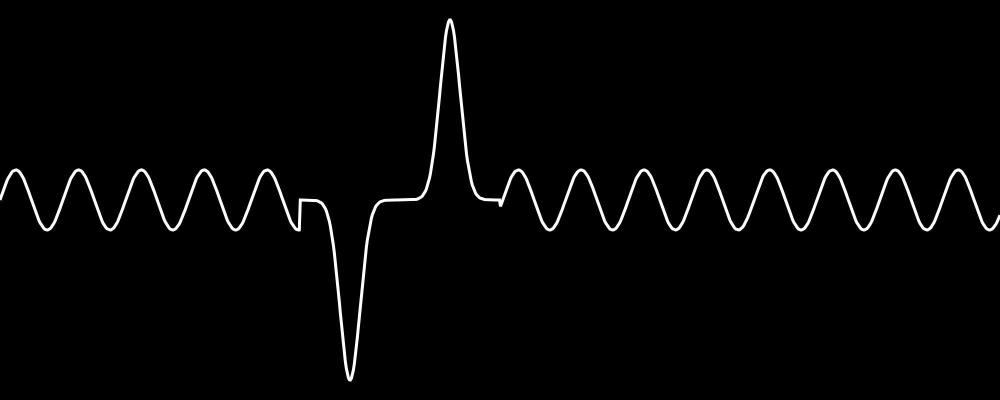
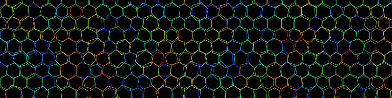
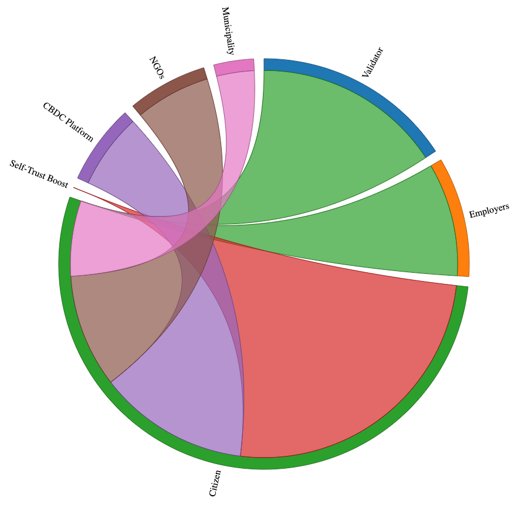
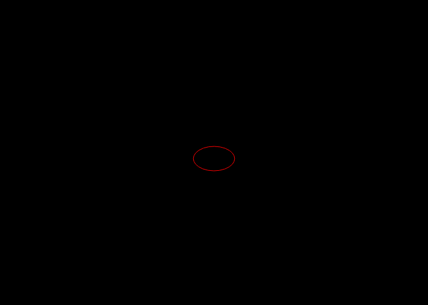
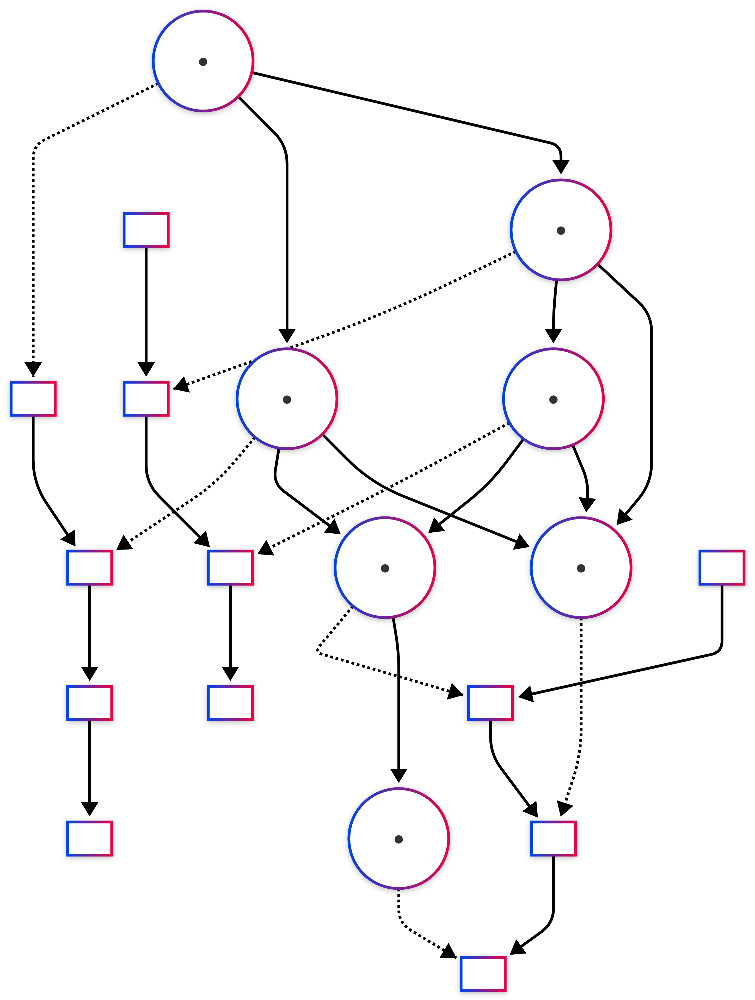

# Digital Blockchain Patents

Welcome to the official repository for the **Digital Blockchain** provisional patent portfolio — a revolutionary framework for **offline-capable**, **lightweight**, and **hardware-optimized blockchain technology**.

This repo contains the full text of foundational patents covering innovations in:

- ✅ 128-bit monotonic timestamping (no UNIX time required)
- ✅ Offline transaction synchronization without consensus
- ✅ Blockchain-on-paper: embedding cryptographic chains into physical cash
- ✅ Embedded blockchain systems (ESP32, FPGA, RISC-V, etc.)
- ✅ Post-quantum and minimal-energy cryptographic architectures

---

## 🔍 Why This Matters
Conventional blockchains are bloated, consensus-bound, and online-only.  
**Digital Blockchain** is different:

## 🧱 Blockchain Infrastructure
- 🛰️ No need for satellites, time servers, or global consensus  
- 🧾 Blocks can exist **offline**, embedded in **paper currency**, **POS devices**, or **sensor networks**  
- ⚡ Designed for **instant settlement** between devices — from supercomputers to IoT chips  
- 🛠️ Suitable for **central banks**, **point-of-sale manufacturers**, and **defense-grade embedded systems**  

## 🧠 AI + Inference Engines
- 🧠 **MKSTORM** introduces field-coherent memory: deterministic identity, time ordering, and access across distributed sensors  
- 🧩 **MKULTRA** merges structured system state with domain-specific LLMs for **adaptive**, **context-aware**, **deterministic**, **fit-to-spec** reasoning on constrained hardware  
- ⚙️ **MKCORE** delivers **hard real-time inference** on FPGAs — enabling constant-cycle AI at the tactical edge without CPUs, GPUs, or operating systems  

## 🌐 Networking + Synchronization
- 🌐 **FSR** enables secure, clockless, mesh-based radio networking with no centralized infrastructure  

---

This tech represents a **new category of infrastructure** — merging the digital and physical realms, synchronizing not just data, but **reality itself**.

---
## 📄 Patent & Research Documents
All documents are stored in the `docs/` folder for easy access and download:

| File Name | Description |
|-----------|-------------|
| [mkrand_article.pdf](https://taguniversal.github.io/digital_blockchain_patents/mkrand_article.pdf) | **Hardware-Native Blockchain: Enabling Secure, Stateless Digital Currency for a Post-Crypto Era**. This document summarizes the architecture and use-cases for MKRAND and PSI-Indexed currency as a practical alternative to traditional consensus-based proof-of-inconvenience blockchains. |
| [digital_economy.pdf](https://taguniversal.github.io/digital_blockchain_patents/digital_economy.pdf) | Vision paper outlining the broader **Digital Economy** — device economies of meaning enabled by blockchain, offline transactions, constant-time databases, and decentralized device networks. |
| [cbdc_shock.pdf](https://taguniversal.github.io/digital_blockchain_patents/cbdc_shock.pdf) | **The Shock Doctrine Reimagined**. A strategic policy brief proposing programmable CBDCs as a financial shock absorber for the European economy, enabling real-time stabilization, industry protection, and future-proof economic coordination.   |
| [qct.pdf](https://taguniversal.github.io/digital_blockchain_patents/qct.pdf) | **Quantum-Cellular Technology (QCT)**. A foundational architectural paper introducing MKRAND deterministic entropy, MKSTORM constant-time blockchain memory, and the MKULTRA event-driven intelligence model. Demonstrates classical entanglement, distributed determinism without consensus, and a hardware-scalable framework for edge AI, CBDC infrastructure, and autonomous systems.   |
| [tsal.pdf](https://taguniversal.github.io/digital_blockchain_patents/tsal.pdf) | **Texas USD Settlement & Attestation Layer (TSAL)**. A legally compliant, USD-preserving whitepaper proposing a state-administered digital settlement, audit, and resilience substrate for funds administered within Texas jurisdiction. Introduces a cryptographic attestation layer for custody, transfer, and reconciliation of USD—without issuing a new currency or altering federal monetary authority. Designed for incremental adoption across state agencies, disaster relief, vendor payments, and audit workflows.   |
| [proof_of_worth.pdf](https://taguniversal.github.io/digital_blockchain_patents/proof_of_worth.pdf) | **Proof of Worth: A Human-Centered Protocol for Reintegrative Economies**. A decentralized framework for social restoration, enabling the economically invisible to re-enter society through trust-based microtasking, instant remuneration, and portable digital reputation. The system promotes human dignity by linking programmable CBDC to acts of civic contribution, not capital.    |
| [patent_cbdc.pdf](https://taguniversal.github.io/digital_blockchain_patents/patent_cbdc.pdf) | Patent application describing the architecture for a **Central Bank Digital Currency (CBDC)** that works offline using printable blockchain blocks. [Application #63/800,999].   |
| [patent_mkrand.pdf](https://taguniversal.github.io/digital_blockchain_patents/patent_mkrand.pdf) | Patent application for **MKRAND**, a cryptographically secure random bit generator designed for deterministic event ordering across isolated blockchain nodes. [Application #63/799,923].   |
| [patent_nash.pdf](https://taguniversal.github.io/digital_blockchain_patents/patent_nash.pdf) | Patent application introducing the **Nash Cipher**, a novel encryption system designed for ultra-lightweight, post-quantum streaming encryption. [Application #63/800,566]    |
| [patent_fsr.pdf](https://taguniversal.github.io/digital_blockchain_patents/patent_fsr.pdf) | Patent application for **Full Spectrum Radio (FSR)**, a novel frequency-hopping communication protocol using deterministic digital entropy for secure, clockless mesh networking and decentralized swarming. [Application #63/850,261]   |
| [patent_mkstorm.pdf](https://taguniversal.github.io/digital_blockchain_patents/patent_mkstorm.pdf) | Patent application for **MKSTORM**, a field-coherent mesh architecture for real-time perception, memory, and distributed synchronization using deterministic entropy-based addressing. [Application #63/852,649]   |
| [patent_mkultra.pdf](https://taguniversal.github.io/digital_blockchain_patents/patent_mkultra.pdf) | Patent application for **MKULTRA**, a grounded AI framework integrating structured state databases with domain-specific language models for self-training, adaptive self-improvement and deterministic reasoning in dynamic systems (e.g., chess, robotics, avionics, governance). [Application: #63/854,134]   |
| [patent_mkcore.pdf](https://taguniversal.github.io/digital_blockchain_patents/patent_mkcore.pdf) | Patent application for **MKCORE**, an FPGA-based domain-specific inference engine designed to bring large language model capabilities to edge environments with extreme energy efficiency, resilience, and tamper-resistant hardware execution. Suitable for autonomous drones, microsatellites, and battlefield AI with no need for CPUs or GPUs. [Application Pending]    **MKCORE provides hard real-time inference**, with fixed-cycle latency and deterministic signal routing. This enables AI models to operate in mission-critical contexts such as aerospace, battlefield systems, and autonomous navigation — where timing guarantees are non-negotiable. By eliminating GPUs, operating systems, and dynamic software stacks, MKCORE delivers a **10× reduction in component cost** and **orders-of-magnitude lower power consumption**, making it uniquely suited for edge deployments where efficiency, size, and predictability are paramount.

## ⚡ Digital Blockchain Energy Metrics
---
| **System** | **Energy per Block**     | **Block Time**     | **Relative Efficiency**   |
|------------|--------------------------|--------------------|----------------------------|
| Bitcoin    | ~1.8 billion joules      | 10 minutes         | 545 quadrillion ×         |
| Ethereum   | ~108,000 joules          | 12 seconds         | 32 trillion ×             |
| MKRAND     | ~3.3 nanojoules          | 1.3 microseconds   | 
𝕀
  |

## 📈 Nash Cipher Performance / Complexity Metrics

| **Technology**   | **Platform**           | **Throughput (Mbps)** | **Relative Complexity** |
|------------------|------------------------|------------------------|--------------------------|
| Nash Cipher      | FPGA (mid-range)       | ~1,000                 | Very Low                 |
| Nash Cipher      | ASIC (optimized)       | >10,000                | Extremely Low            |
| AES-128          | FPGA (mid-range)       | ~500                   | Moderate                 |
| AES-128          | ASIC (optimized)       | ~2,000–5,000           | Moderate                 |
| RSA-2048         | CPU (server-grade)     | ~0.1                   | Extremely High           |
| ECC (P-256)      | CPU (server-grade)     | ~0.5                   | Very High                |

👉 These files represent the foundational IP for **Digital Blockchain** — a system designed to transcend the limitations of conventional cryptocurrency platforms.

---

## 🧠 Use Cases

- Central Bank Digital Currency (CBDC)
- Offline payment terminals
- Blockchain receipts embedded in physical assets
- Supply chain or defense asset tracking
- Anti-counterfeit systems for physical currency

---
## Quantum Cellular Computing

While much of the industry remains focused on quantum computing’s elusive promise, Quantum Cellular Computing offers a practical, deterministic alternative. Where quantum systems rely on entanglement and speculative error correction to explore high-dimensional configuration spaces, Quantum Cellular Computing uses massive parallelism, deterministic entropy, and cellular automata principles to deliver similar capabilities with reproducibility, simplicity, and orders-of-magnitude higher energy efficiency.

## Entropy, Observation, and the Teleology of Computation

While quantum machines strive for sterile, error-free isolation, deterministic cellular automata embrace entropy as a generative substrate, coupling randomness to purpose in a reproducible, scalable way. Rather than banishing uncertainty, these architectures harness it as the medium from which novelty and insight emerge.

## 🔗 More Resources

- [DigitalBlockchain.io](https://digitalblockchain.io) – Vision and ecosystem
- [Contact the Inventor](mailto:taguniversalsoftware@gmail.com)

---

## 💬 License & Sharing

These documents are shared for public reading and discussion. For licensing, collaborations, or investment opportunities, please get in touch.

---

> _“The next wave of blockchain isn’t virtual — it’s tangible.”_
