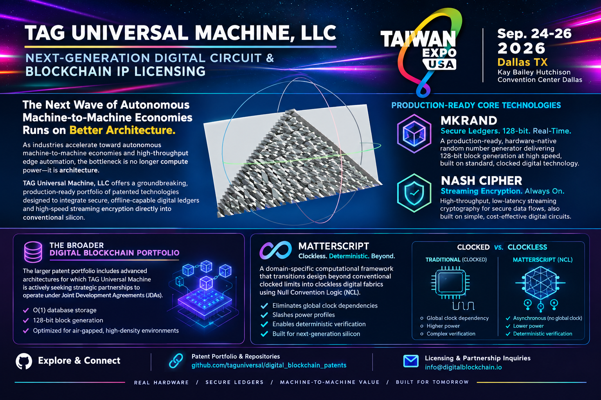

# Next-Generation Digital Circuit & Blockchain IP Licensing

As industries accelerate toward autonomous machine-to-machine economies and high-throughput edge automation, the bottleneck is no longer compute power—it is architecture. **TAG Universal Machine, LLC** offers a groundbreaking, production-ready portfolio of patented technologies designed to integrate secure, offline-capable digital ledgers and high-speed streaming encryption directly into conventional silicon.

At the foundation of this portfolio are **MKRAND** and the **Nash Cipher**, which are fully production-ready and built on standard, clocked digital technology. Because these architectures rely on conventional digital design, they represent simple, exceptionally cheap-to-manufacture digital circuits. This allows OEMs to seamlessly embed hardware-native blockchain capabilities—enabling true machine-to-machine value economies—alongside ultra-fast streaming encryption without adding complexity or exorbitant fabrication costs.

While MKRAND and the Nash Cipher provide immediate deployment paths for secure ledgers and streaming crypto, the broader digital blockchain patent portfolio encompasses advanced architectures for which TAG Universal Machine is actively seeking strategic partnerships to operate under **Joint Development Agreements (JDAs)**. These patents deliver O(1) database storage and 128-bit block generation optimized for air-gapped, high-density environments.

Taking architectural efficiency a step further, the ecosystem integrates **[MatterScript](https://github.com/taguniversal/matterscript/)**—a domain-specific computational framework that transitions design beyond conventional clocked limits into clockless digital fabrics utilizing **Null Convention Logic (NCL)**. By leveraging asynchronous boundary completeness, MatterScript eliminates global clock dependencies, slashing power profiles and enabling deterministic verification for next-generation silicon.

### Explore & Connect

* **Patent Portfolio & Repositories:** [github.com/taguniversal/digital_blockchain_patents](https://github.com/taguniversal/digital_blockchain_patents)
* **Licensing & Partnership Inquiries:** [info@digitalblockchain.io](mailto:info@digitalblockchain.io)